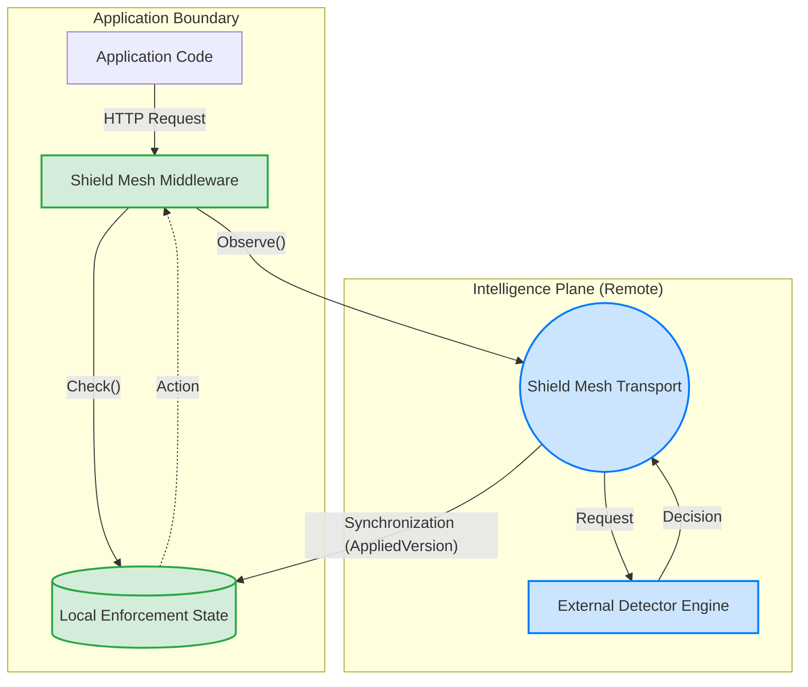
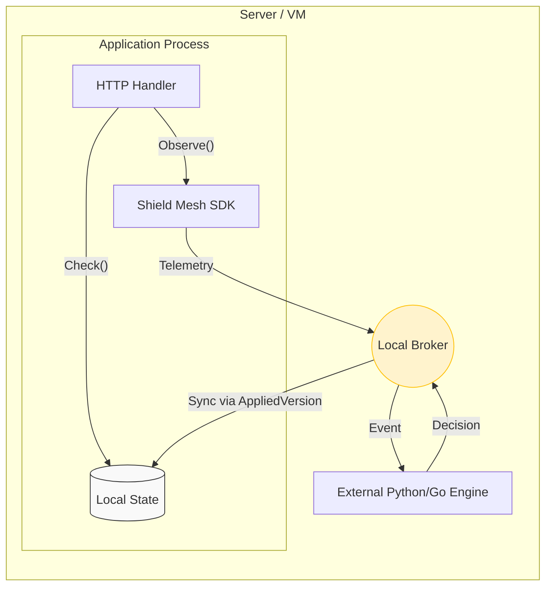
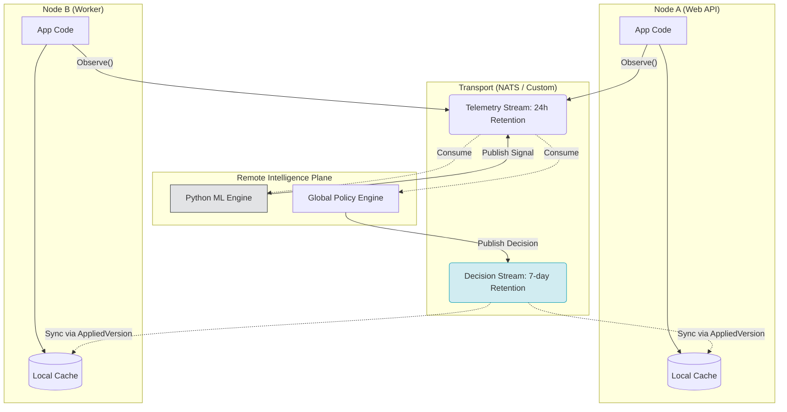

# Research & Competitive Landscape

These documents establish how we measure Shield Mesh's success, how we validate its resilience, and where it sits in the broader security ecosystem.

### Performance & Latency Targets

Shield Mesh is designed on the premise that enforcement must be local and synchronous, while intelligence must be distributed and asynchronous. This document defines the Service Level Objectives (SLOs) that the implementation must prove.

**1. Enforcement Latency (`Check`)**
* **Target**: < 1 microsecond (p99).
* **Measurement:** Time taken from `shield.Check()` invocation to returning a locally evaluated `Decision ` without requiring a network round trip.
* **Constraints:** Must be measured under heavy concurrent read load. This proves the efficacy of the lock-free or sync.RWMutex local state store.

**2. Observation Overhead (`Observe`)**
* **Target:** < 5 microseconds (p99) on the hot path.
* **Measurement:** Time taken for shield.Observe() to return control to the application.
* **Constraints**: Must measure the serialization of the event and dropping it onto the transport buffer. It must not include network transit time.

**3. Intelligence Propagation Delay**

* **Target (Fabric Mode):** < 50 milliseconds (p95) within a single region.
* **Measurement:** The delta between the telemetry event creation timestamp and the corresponding Decision being synchronized into the Node's Local Enforcement State.

**4. Memory Footprint (Node)**
* Target: < 50MB for 100,000 active Subject decisions.
* Measurement: Heap profile of the `memory.StateStore` map. Ensures the local materialization strategy doesn't cause Application Node OOM crashes.

### Distributed Failure Validation
Because Shield Mesh relies on eventual consistency for intelligence distribution, we must empirically prove our failure semantics. These experiments will be automated as integration tests.

**Experiment 1: The Dead Engine**

* **Hypothesis:** If an Engine crashes, request-path enforcement continues using existing cached state.
* **Execution:** Run 1 Node and 1 BruteForce Engine. Trigger a block. Kill the Engine process. Send a request from the blocked IP.
* **Expected Result:** The request is dropped instantly. The local state remains authoritative until the TTL expires.

Experiment 2: The Broker Partition (Backpressure)
* **Hypothesis:** If the transport (NATS or Custom Fabric) is unreachable, the Node will drop telemetry rather than crashing the application, and normal Check() evaluation will continue.

* **Execution:** Run 1 Node connected to NATS. Simulate a network partition via `iptables`. Blast the Node with 10,000 requests/sec.

* **Expected Result:** Application continues serving 200 OK (assuming a Fail Open policy) or drops requests (assuming a Fail Closed policy). Observe() buffers fill up, and subsequent events are dropped. Memory usage remains stable.

**Experiment 3: Versioned Decision Synchronization (Cold Start & Recovery)**

* **Hypothesis:** A newly booted or reconnecting Node will synchronize decisions newer than its AppliedVersion before subscribing to subsequent changes.
* **Execution:** Populate the transport with 10,000 active blocked IPs (within the 7-day retention window). Boot a fresh Node with AppliedVersion = 0.
* **Expected Result:** The Node sequentially fetches the historical decisions, updates its AppliedVersion state, applies them locally, and then begins processing requests accurately.

# Architecture Diagrams (Mermaid)
These diagrams visualize the structural boundaries and data flows.

